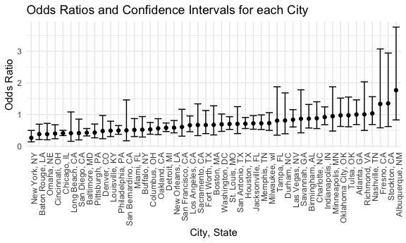
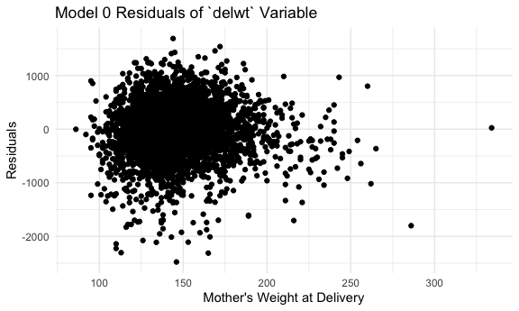

P8105 Homework 6 - UNI: gvs2113
================
2023-11-20

## Problem 1

**Load in the data from github link:**

``` r
url = "https://raw.githubusercontent.com/washingtonpost/data-homicides/master/homicide-data.csv"
homicide_html = read_csv(url)
```

    ## Rows: 52179 Columns: 12
    ## ── Column specification ────────────────────────────────────────────────────────
    ## Delimiter: ","
    ## chr (9): uid, victim_last, victim_first, victim_race, victim_age, victim_sex...
    ## dbl (3): reported_date, lat, lon
    ## 
    ## ℹ Use `spec()` to retrieve the full column specification for this data.
    ## ℹ Specify the column types or set `show_col_types = FALSE` to quiet this message.

**Creating a `city_state` variable and performing instructed data
cleaning steps.**

``` r
homicide_df = 
  homicide_html |> 
  mutate(
    city_state = paste(city, state, sep = ", "),
    resolution = case_when(
      disposition == "Closed without arrest" ~ 0,
      disposition == "Open/No arrest"        ~ 0,
      disposition == "Closed by arrest"      ~ 1))|> 
  filter(!(city_state %in% c("Dallas, TX", "Pheonix, AZ", "Kansas City, MO", "Tulsa, AL"))) |> 
  filter(victim_race %in% c("White", "Black")) |> 
  mutate(
    victim_age = replace(victim_age, victim_age == "Unknown", NA),
    victim_age = as.numeric(victim_age)
  )
```

**Baltimore, MD logisitic regression**

``` r
baltimore = 
  homicide_df |> 
  filter(city_state == "Baltimore, MD")

b_fit = glm(resolution ~ victim_age + victim_sex + victim_race, data = baltimore) |> 
  broom::tidy() |> 
  mutate(
    OR = exp(estimate),
    OR_CI_upper = exp(estimate + 1.96 * std.error),
    OR_CI_lower = exp(estimate - 1.96 * std.error)) |>
  filter(term == "victim_sexMale") |> 
  select(OR, OR_CI_upper, OR_CI_lower) 

b_fit |> 
  knitr::kable(digits = 3)
```

|    OR | OR_CI_upper | OR_CI_lower |
|------:|------------:|------------:|
| 0.816 |       0.868 |       0.766 |

**Logistic Regression for all cities**

``` r
all_city = 
  homicide_df |> 
  nest(data = -city_state) |> 
  mutate(
    model_map = map(data, \(df) glm(resolution ~ victim_age + victim_sex + victim_race, family = binomial(), data = df)),
    tidy_model = map(model_map, broom::tidy)) |> 
  select( -model_map, -data) |> 
  unnest(cols = tidy_model) |> 
  mutate(
    OR = exp(estimate),
    OR_CI_upper = exp(estimate + 1.96 * std.error),
    OR_CI_lower = exp(estimate - 1.96 * std.error)) |>
  filter(term == "victim_sexMale") |> 
  select(city_state, OR, OR_CI_upper, OR_CI_lower) 

all_city |> 
  head(10) |> 
  knitr::kable(digits = 3)
```

| city_state      |    OR | OR_CI_upper | OR_CI_lower |
|:----------------|------:|------------:|------------:|
| Albuquerque, NM | 1.767 |       3.761 |       0.831 |
| Atlanta, GA     | 1.000 |       1.463 |       0.684 |
| Baltimore, MD   | 0.426 |       0.558 |       0.325 |
| Baton Rouge, LA | 0.381 |       0.695 |       0.209 |
| Birmingham, AL  | 0.870 |       1.318 |       0.574 |
| Boston, MA      | 0.674 |       1.276 |       0.356 |
| Buffalo, NY     | 0.521 |       0.935 |       0.290 |
| Charlotte, NC   | 0.884 |       1.403 |       0.557 |
| Chicago, IL     | 0.410 |       0.501 |       0.336 |
| Cincinnati, OH  | 0.400 |       0.677 |       0.236 |

**Plot for OR and CI for each city**

``` r
all_city |> 
  mutate(city_state = fct_reorder(city_state, OR)) |> 
  ggplot(aes(x = city_state, y = OR)) + 
  geom_point() + 
  geom_errorbar(aes(ymin = OR_CI_lower, ymax = OR_CI_upper)) + 
  theme(axis.text.x = element_text(angle = 90, hjust = 1))
```



Need to add comments

## Problem 2

**Load in the data:**

``` r
weather_df = 
  rnoaa::meteo_pull_monitors(
    c("USW00094728"),
    var = c("PRCP", "TMIN", "TMAX"), 
    date_min = "2022-01-01",
    date_max = "2022-12-31") |>
  mutate(
    name = recode(id, USW00094728 = "CentralPark_NY"),
    tmin = tmin / 10,
    tmax = tmax / 10) |>
  select(name, id, everything())
```

    ## using cached file: /Users/gracesantos/Library/Caches/org.R-project.R/R/rnoaa/noaa_ghcnd/USW00094728.dly

    ## date created (size, mb): 2023-09-28 10:20:18.929435 (8.524)

    ## file min/max dates: 1869-01-01 / 2023-09-30

## Problem 3

**Load in the data:**

``` r
birth_data = read_csv("./data/birthweight.csv") |> 
  janitor::clean_names() |> 
  mutate(
    babysex = case_match(babysex, 
      1 ~ "male", 
      2 ~ "female"), 
    babysex = as.factor(babysex),
    frace = case_match(frace, 
      1 ~ "white",
      2 ~ "black",
      3 ~ "asian",
      4 ~ "puerto_rican",
      8 ~ "other",
      9 ~ "unknown"),
    frace = as.factor(frace),
    malform = case_match(malform, 
      0 ~ "absent", 
      1 ~ "present"), 
    malform =  as.factor(malform),
    mrace = case_match(mrace, 
      1 ~ "white",
      2 ~ "black",
      3 ~ "asian",
      4 ~ "puerto_rican",
      8 ~ "other",
      9 ~ "unknown"),
    mrace = as.factor(mrace)
  )
```

    ## Rows: 4342 Columns: 20
    ## ── Column specification ────────────────────────────────────────────────────────
    ## Delimiter: ","
    ## dbl (20): babysex, bhead, blength, bwt, delwt, fincome, frace, gaweeks, malf...
    ## 
    ## ℹ Use `spec()` to retrieve the full column specification for this data.
    ## ℹ Specify the column types or set `show_col_types = FALSE` to quiet this message.

For all data, there is a 0 entered for columns: `pnumlbw` (previous
number of low birth weight babies) and `pnumgsa` (number of prior small
for gestational age babies).

**Hypothesized regression model**

``` r
model_0 = lm(bwt ~ momage + delwt, data = birth_data) 

model_0|> 
  broom::tidy() |> 
  select(term, estimate, p.value) |>
  knitr::kable(digits = 3)
```

| term        | estimate | p.value |
|:------------|---------:|--------:|
| (Intercept) | 1867.976 |       0 |
| momage      |   15.200 |       0 |
| delwt       |    6.443 |       0 |

The above linear regression model was chosen to assess the influence of
measured factors of the mother at delivery on the baby’s birthweight.

**Predictors and Residuals**

``` r
birth_data |> 
  modelr::add_residuals(model_0) |> 
  ggplot(aes(x = momage, y = resid)) + geom_point()
```


``` r
birth_data |> 
  modelr::add_residuals(model_0) |> 
  ggplot(aes(x = delwt, y = resid)) + geom_point()
```


``` r
birth_data |>   
  modelr::add_predictions(model_0) |>
  ggplot(aes(x = momage, y = pred)) + geom_point()
```


``` r
birth_data |>   
  modelr::add_predictions(model_0) |>
  ggplot(aes(x = delwt, y = pred)) + geom_point()
```


**Other models to compare**

``` r
model_1 = lm(bwt ~ blength + gaweeks, data = birth_data)

model_1|> 
  broom::tidy() |> 
  knitr::kable(digits = 3)
```

| term        |  estimate | std.error | statistic | p.value |
|:------------|----------:|----------:|----------:|--------:|
| (Intercept) | -4347.667 |    97.958 |   -44.383 |       0 |
| blength     |   128.556 |     1.990 |    64.604 |       0 |
| gaweeks     |    27.047 |     1.718 |    15.744 |       0 |

``` r
model_2 = lm(bwt ~ bhead + blength + babysex + bhead * blength + bhead * babysex + blength * babysex + bhead * blength * babysex, data = birth_data)

model_2|> 
  broom::tidy() |> 
  knitr::kable(digits = 3)
```

| term                      |  estimate | std.error | statistic | p.value |
|:--------------------------|----------:|----------:|----------:|--------:|
| (Intercept)               |  -801.949 |  1102.308 |    -0.728 |   0.467 |
| bhead                     |   -16.598 |    34.092 |    -0.487 |   0.626 |
| blength                   |   -21.646 |    23.372 |    -0.926 |   0.354 |
| babysexmale               | -6374.868 |  1677.767 |    -3.800 |   0.000 |
| bhead:blength             |     3.324 |     0.713 |     4.666 |   0.000 |
| bhead:babysexmale         |   198.393 |    51.092 |     3.883 |   0.000 |
| blength:babysexmale       |   123.773 |    35.119 |     3.524 |   0.000 |
| bhead:blength:babysexmale |    -3.878 |     1.057 |    -3.670 |   0.000 |

**Cross Validation**

``` r
cv_df = 
  crossv_mc(birth_data, 100) 

cv_df =
  cv_df |> 
  mutate(
    train = map(train, as_tibble),
    test = map(test, as_tibble))

cv_df = 
  cv_df |> 
  mutate(
    cv_mod_0  = map(train, \(df) lm(bwt ~ momage + delwt, data = df)),
    cv_mod_1  = map(train, \(df) lm(bwt ~ blength + gaweeks, data = df)),
    cv_mod_2  = map(train, \(df) lm(bwt ~ bhead + blength + babysex + bhead * blength + bhead * babysex + blength * babysex + bhead * blength * babysex, data = df))) |> 
  mutate(
    rmse_model_0 = map2_dbl(cv_mod_0, test, \(mod, df) rmse(model = mod, data = df)),
    rmse_model_1 = map2_dbl(cv_mod_1, test, \(mod, df) rmse(model = mod, data = df)),
    rmse_model_2 = map2_dbl(cv_mod_2, test, \(mod, df) rmse(model = mod, data = df)))

cv_df |> 
  select(starts_with("rmse")) |> 
  pivot_longer(
    everything(),
    names_to = "model", 
    values_to = "rmse",
    names_prefix = "rmse_") |> 
  mutate(model = fct_inorder(model)) |> 
  ggplot(aes(x = model, y = rmse)) + geom_violin()
```


